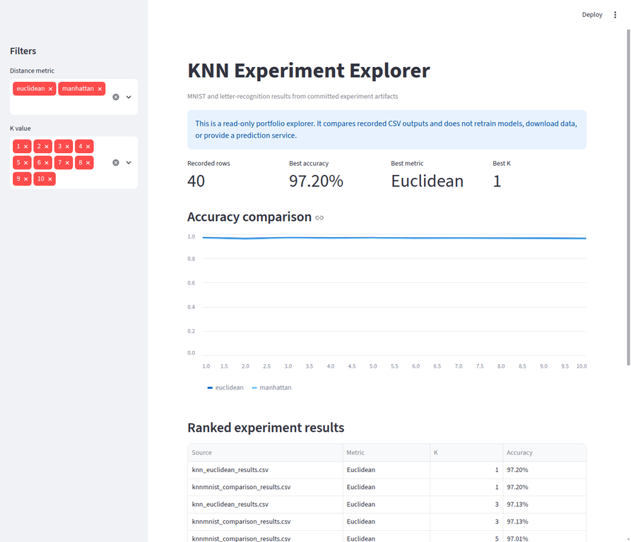

# MNIST and Letter Recognition with K-Nearest Neighbors

A consolidated machine-learning study comparing **K-Nearest Neighbors (KNN)** for handwritten digit and alphabet-character recognition. The project examines how distance metrics and neighborhood size affect classification accuracy, while preserving the original notebooks, exported result tables, and written report.

This repository is presented as a reproducible educational classification case study. The recorded metrics reflect the original notebook experiments and should not be interpreted as newly reproduced benchmarks until the exact data sources, preprocessing steps, and evaluation environment are rerun.

## Project overview

The work brings together related experiments from the original MNIST and letter-recognition repositories into one canonical project. It demonstrates a complete classical machine-learning workflow: dataset loading, KNN configuration, metric comparison, confusion-matrix inspection, result export, and experiment interpretation.

| Area | Implementation |
| --- | --- |
| Learning problem | Supervised multiclass image/character classification |
| Algorithm | K-Nearest Neighbors |
| Distance metrics | Euclidean, Manhattan, and Chebyshev |
| Hyperparameter | Neighborhood size `K` |
| Evaluation | Accuracy and confusion matrices from the recorded runs |
| Artifacts | Jupyter notebooks, CSV/XLSX tables, and a written report |
| Presentation | Streamlit results explorer for comparing committed experiment outputs |

## Recorded result snapshot

The committed MNIST comparison table records the following representative accuracy values for `K = 1`:

| Distance metric | Recorded accuracy |
| --- | ---: |
| Manhattan | 0.9657 |
| Euclidean | 0.9720 |

These values are retained as portfolio evidence from the original experiment. They are not a claim about current state-of-the-art performance, and the repository does not silently regenerate or overwrite the original result files.

## Results explorer

`results_explorer.py` is a lightweight, read-only Streamlit application that loads the committed CSV result tables and presents them as a recruiter-friendly comparison view. It supports metric filtering, K-value comparison, an accuracy chart, and a ranked result table. The app does not retrain models, download data, modify artifacts, or accept external submissions.

```bash
python -m venv .venv

# Windows PowerShell
.venv\\Scripts\\Activate.ps1

# macOS/Linux
source .venv/bin/activate

pip install -r requirements-dashboard.txt
streamlit run results_explorer.py
```



*Local screenshot of the read-only KNN comparison dashboard built from the committed experiment tables.*

## Repository contents

```text
.
├── notebooks/
│   ├── mnist_knn_comparison.ipynb
│   └── letter_recognition_knn.ipynb
├── results/
│   ├── knn_euclidean_results.csv
│   ├── knn_manhattan_results.csv
│   ├── knnmnist_comparison_results.csv
│   ├── knn_chebyshev_results.xlsx
│   ├── knnletterrecognition_results.xlsx
│   └── mnist_knn_report.docx
├── analysis.py
├── results_explorer.py
├── requirements-dashboard.txt
├── tests/
│   └── test_analysis.py
├── .gitignore
└── README.md
```

## Notebook workflow

Start with `notebooks/mnist_knn_comparison.ipynb` to review the MNIST distance-metric comparison. Then open `notebooks/letter_recognition_knn.ipynb` for the alphabet-character experiment. Each notebook contains its own dataset-loading and preprocessing assumptions, so readers should inspect those cells before attempting a fresh run.

For a clean local notebook environment:

```bash
pip install jupyter notebook numpy pandas scikit-learn matplotlib seaborn openpyxl
jupyter notebook
```

The exported result files are kept separate from the dashboard so that the presentation layer remains fast, transparent, and independent of model training.

## Interpretation and limitations

KNN is an intuitive baseline that can perform well on compact feature representations, but prediction cost grows with the reference set and performance is sensitive to feature scaling, distance choice, and the value of `K`. The project should therefore be discussed as a classical-baseline comparison rather than a production recognition service.

The original artifacts use notebook-specific paths and environments. For a research-grade reproduction, document the exact dataset versions, preprocessing pipeline, train/test split, hardware, runtime, and per-class metrics. Accuracy alone can conceal class-specific weaknesses, so future extensions should add normalized confusion matrices, macro-averaged precision/recall/F1, and inference-time comparisons.

## Reproducibility and responsible use

The dashboard reads committed artifacts only and does not make claims about individuals or real-world identity. Any future deployment involving handwriting or character recognition should address data consent, demographic or writing-style variation, error analysis, and the consequences of incorrect predictions.

## References

The notebooks and report contain the original experiment-specific source references and dataset-loading instructions. See the notebook cells under `notebooks/` and the report under `results/` before reproducing the recorded results.

[1]: https://scikit-learn.org/stable/modules/neighbors.html
[2]: https://scikit-learn.org/stable/modules/model_evaluation.html

## License

No new license was inferred during consolidation. Review the source repositories and dataset terms before redistributing the notebooks, report, or derived artifacts.

## Author

**Umer Sajid** — MS Data Science student targeting machine-learning engineering and data-science roles.
